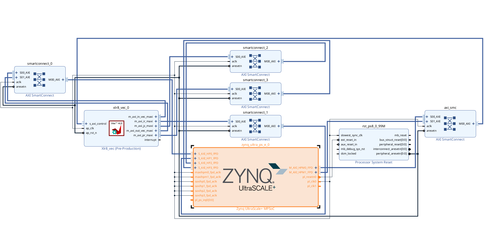

# Fly Like an Eagle: Accelerating Embedded Convex Solver for Autonomous Deep Space Satellites
An FPGA project made by Samuele Tondelli and Leonardo Bertolani for the AMD Open Hardware Competition.

## Description
This project aims to create an FPGA accelerator on the Kria KD240 board to speed up the resolution of SOCP (Second-Order Cone Programming) problems on embedded platforms. This capability is essential for the emerging field of autonomous deep space exploration. We focused on ECOS, an open-source library designed to solve such problems, and decided to accelerate five specific functions:
- **spmv**: Sparse matrix-vector multiplication.
- **spmtvm**: Transposed sparse matrix-vector multiplication.
- **lsolve**: Solves the L part of an LDLt system.
- **dsolve**: Solves the D part of an LDLt system.
- **ltsolve**: Solves the Lt part of an LDLt system.

The project was developed using Vitis HLS, creating a monolithic accelerator called xlr8_vec.

## Repository Structure
- **bitstream**: Contains the necessary files for uploading the bitstream.
- **images**: Images used in the README.
- **logs**: Scripts and files for measuring power consumption.
- **power_hw**: Sources for generating power measurements.
- **xlr8**: Contains the HLS source files. Files with the suffix ```_tb``` are testbench files.

## Usage
For development, we used Vitis 2024.2. The IP creation process is as follows:
- Create a new component with the target platform ```xck24-ubva530-2LV-c```, a target clock of ```7ns```, and an uncertainty of ```1ns```.
- Add all non-testbench files from folders ending with ```_vec``` as sources. You can optionally add ```xlr8_vec_tb.cpp``` as a testbench.
- Run the Synthesis and Package steps in Vitis to generate the IP.

To generate the bitstream, we used Vivado 2024.2 with the following procedure:
- Create a new project with the Kria KD240 as the target platform.
- Import the generated IP and create a new Block Design. Enable all AXI HP slaves and set ```PL``` fabric clocks ```PL0``` and ```PL1``` to ```250 MHz```. The Block Design should look like this:



- Create an HDL wrapper and run the Synthesis and Implementation steps. For strategies, we used ```Flow_PerfOptimized_high``` and ```Performance_ExplorePostRoutePhysOpt```, respectively.
- Generate the bitstream and export the hardware to get the necessary files, which can also be found in the bitstream folder of this repository.

Note: The generated bitstream has a negative WNS (Worst Negative Slack), but we found no signs of instability during our tests.

Once the files are generated, upload them to the Kria board using the PYNQ environment and a Jupyter Notebook, as shown below:
```python
from pynq import Overlay
import pynq
import numpy as np
import time
ov = Overlay("./deep_space_vec_250_wrapper.bit")
```

## Benchmarks
All benchmarks can be built with their respective Makefiles by running ```make```. The ```logs/log_power.c``` file is the only exception and can be compiled with:
```
gcc -o log_power log_power.c -O3
```

To try out the code, simply run the following command, which will build the environment, load the bitstream, and launch the ```xrt_test``` script:
```
sudo ./setup.sh
```
